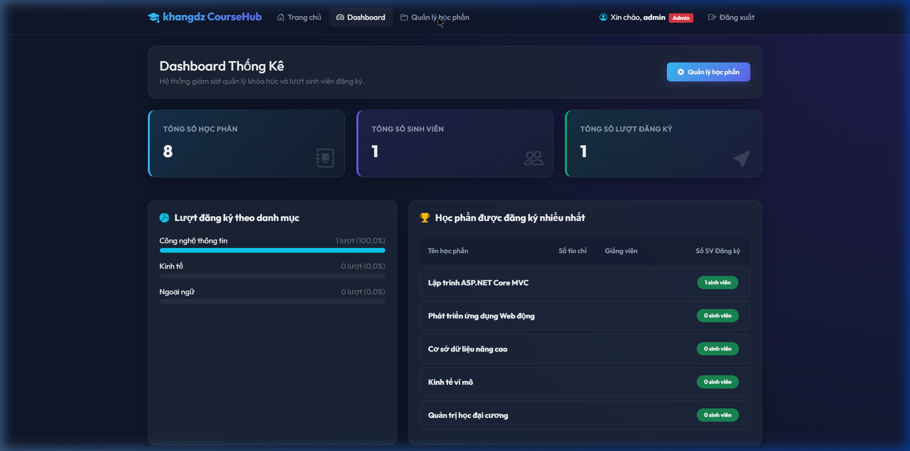

# 🎓 Course Registration System - Hệ thống đăng ký học phần sinh viên

Dự án bài kiểm tra giữa kỳ môn Lập trình Web - Hệ thống đăng ký học phần và quản lý tài khoản cho sinh viên sử dụng **ASP.NET Core 8.0 MVC**, **Entity Framework Core (SQL Server)** và **ASP.NET Core Identity**.

Giao diện ứng dụng được thiết kế theo phong cách mờ kính **Glassmorphism** tối giản, hiện đại và chuẩn Responsive.

---

## 📸 Hình ảnh giao diện ứng dụng

### 1. Trang chủ - Danh sách học phần (Câu 1, 6, 8)
*Hỗ trợ tìm kiếm học phần, phân trang đúng 5 học phần/trang, hiển thị trạng thái và nút bấm Đăng ký/Hủy đăng ký học phần trực tiếp đối với Student.*


### 2. Admin Dashboard - Thống kê hệ thống (Câu 10)
*Bảng điều khiển cho phép theo dõi trực quan số liệu đăng ký học tập, phân bố tỉ lệ đăng ký theo danh mục bằng biểu đồ thanh tiến trình và bảng xếp hạng học phần được đăng ký nhiều nhất.*


---

## 🛠️ Chi tiết các câu hỏi đã hoàn thiện

### **Câu 1 (2,5 điểm) - Danh sách học phần & Phân trang**
- Hiển thị danh sách học phần đẹp mắt tại Trang chủ gồm: Tên học phần, số tín chỉ, giảng viên, hình ảnh minh họa bằng Razor View.
- Phân trang khoa học: Mỗi trang hiển thị tối đa **5 học phần**.

### **Câu 2 (1,5 điểm) - Quản lý CRUD cho Admin**
- Xây dựng đầy đủ tính năng Thêm (Create), Sửa (Edit), Xóa (Delete) học phần dành riêng cho quản trị viên.
- Sử dụng thuộc tính kiểm soát truy cập `[Authorize(Roles = "Admin")]` và Route Prefix `/admin/**`.
- Hỗ trợ tải tệp ảnh trực tiếp từ máy tính lên thư mục `wwwroot/uploads` hoặc nhập URL liên kết ngoài.

### **Câu 3 (1,0 điểm) - Đăng ký tài khoản (Register)**
- Sử dụng ASP.NET Core Identity để đăng ký tài khoản với các trường: Tên đăng nhập (Username), Mật khẩu (Password), Email.
- Tự động gán Role mặc định: **STUDENT** khi đăng ký thành công.

### **Câu 4 (0,5 điểm) - Cấu hình Phân quyền (Authorization)**
- Cấu hình cookie phân quyền chặt chẽ:
  - `/admin/**` -> Chỉ Role `Admin` được quyền truy cập.
  - `/courses` -> Cho phép mọi người dùng truy cập.
  - `/enroll/**` -> Chỉ Role `Student` (Sinh viên) được quyền đăng ký hoặc hủy đăng ký.

### **Câu 5 (0,5 điểm) - Đăng nhập tài khoản (Login)**
- Form đăng nhập đồng bộ giao diện mờ kính. Đăng nhập thành công sẽ tự động chuyển hướng người dùng về Trang chủ (`/home`).

### **Câu 6 (1,0 điểm) - Đăng ký học phần (Enroll Course)**
- Tự động kiểm tra trạng thái đăng ký của sinh viên hiện tại:
  - Nếu chưa đăng ký: Hiển thị nút xanh **Đăng ký học phần** (POST Form).
  - Nếu đã đăng ký: Hiển thị nút đỏ **Hủy đăng ký** (POST Form).
- Ràng buộc: Chỉ sinh viên mới được thao tác đăng ký học phần.

### **Câu 7 (0,5 điểm) - Học phần của tôi (My Courses)**
- Trang cá nhân dành cho sinh viên hiển thị đầy đủ danh sách các học phần đã đăng ký thành công trong kỳ học hiện tại, hỗ trợ hủy đăng ký nhanh.

### **Câu 8 (0,5 điểm) - Tìm kiếm học phần**
- Ô tìm kiếm linh hoạt trên đầu Trang chủ cho phép tìm kiếm chính xác và lọc các học phần chứa từ khóa người dùng nhập.

### **Câu 9 (1,0 điểm) - Đăng nhập bằng Google**
- Tích hợp thành công đăng nhập dịch vụ ngoài (Google External Login). Tự động tạo và liên kết tài khoản Student mới khi đăng nhập bằng Google lần đầu.

### **Câu 10 (1,0 điểm) - Dashboard Thống kê cho Admin**
- Bảng điều khiển admin tổng hợp dữ liệu thực tế từ database:
  - Tổng số học phần.
  - Tổng số sinh viên.
  - Tổng số lượt đăng ký học phần.
  - Tỉ lệ phân chia đăng ký theo từng Danh mục học phần và Bảng xếp hạng 5 học phần phổ biến nhất.

---

## 🚀 Hướng dẫn khởi chạy ứng dụng

### Yêu cầu hệ thống
- Máy tính cài đặt **.NET SDK 8.0** trở lên.
- Hệ quản trị cơ sở dữ liệu **SQL Server** (Mặc định cấu hình local `localhost\SQLEXPRESS`).

### Khởi động dự án
1. Khởi tạo database và cập nhật Migrations:
   ```bash
   dotnet ef database update
   ```
2. Chạy ứng dụng:
   ```bash
   dotnet run
   ```
3. Truy cập vào website tại đường dẫn cục bộ:
   ```text
   http://localhost:5401
   ```

### 🔑 Tài khoản thử nghiệm mặc định (Seeded):
- **Tài khoản Student:** `student` / Mật khẩu: `Student@123`
- **Tài khoản Admin:** `admin` / Mật khẩu: `Admin@123`

---
*Chúc thầy/cô chấm điểm thuận lợi! Đồ án được hoàn thiện bởi **khangdz & Antigravity**.*
